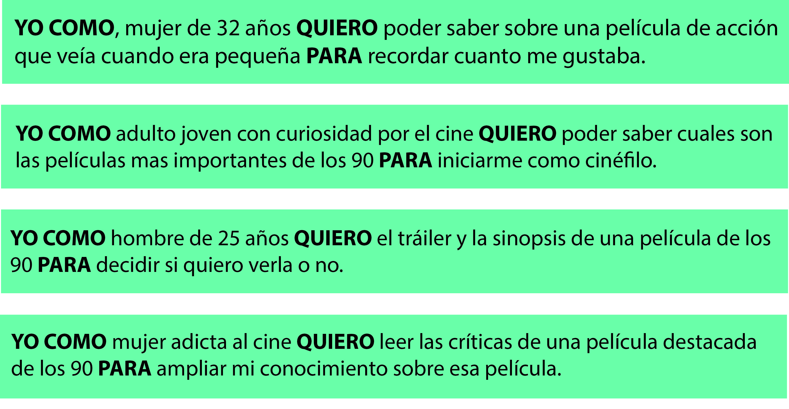
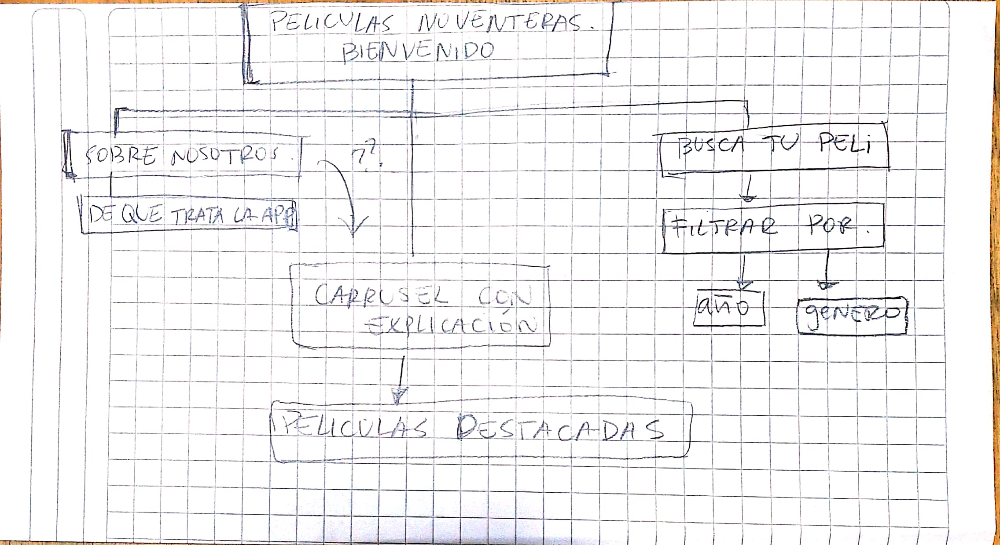
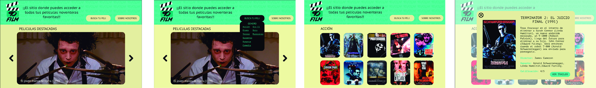

# 🎥 Proyecto sobre sitio web con información sobre películas noventeras 🎬

## Preámbulo 
La moda es cíclica, pero el cine nunca pasa de moda. Con la nostalgia que existe entre los millenials por la década de los 90 actualmente y el boom que han generado las plataformas de visualización de peliculas online hemos creado esta aplicación, donde se mezcla interesantemente la afición a la tecnología y el rememoramiento de películas que fueron icónicas o marcaron la infancia de muchos de nuestros usuarios.  

## ¿De que se trata? 💭
 
 "90film" es un sitio dedicado a entregar información específica sobre películas destacadas de los años 90. Contiene un catálogo acotado de las películas más memorables de la década de los 90 donde puedes seleccionar a través de géneros y encontrar datos como críticas de expertos y trailers oficiales. 

 ***

 ## Estudio de usuario previo 👩👨

 Para comenzar a crear nuestro sitio web se necesitó investigar y conocer sobre las preferencias de los usuarios más adeptos al cine. Para eso se generó una encuesta donde contestaron más de 40 personas y hemos podido extraer los siguientes datos:

 [PARA VER LOS RESULTADOS DE LA ENCUESTA, CLICKEA AQUI 👈](https://docs.google.com/forms/d/1xEUhr4W3P1mvUfnlw7Mr4-GCzMRRK4rg_78_wBpcty0/edit#responses)

+ La mayoría de los encuestados son mujeres de entre 20 a 35 años.

+ La mayoría ve o intenta ver una película más de una vez al mes.

+ La mayoría se inclina hacía los géneros de acción, drama y comedia.

+ Para ver una película la mayoría se fija en el director y la crítica 

+ la información que más buscan al momento de investigar sobre una pelicula es a través de sinopsis escritas y criticas de sitios web.

+ Dentro de las películas favoritas de los encuestados se encuentran en mayoría Titanic, Trainspotting y El joven manos de tijera. 
***

## Comenzando a crear nuestro sitio web 👌

### Historias de usuario
Luego de analizar los resultados de las encuestas realizadas hemos podido sacar 4 historias de usuario que serían las siguientes: 

*Historias de usuario extraídas de las encuestas realizadas.*

Junto a las historias de usuario se ha creado un tablero con las tareas a realizar para este proyecto, puedes revisarlo [AQUI 👈](https://trello.com/b/pJdDPwAP/proyecto-peliculas)

### Diagrama de flujo 
Al tener claras y definidas nuestras historias de usuario hemos procedido más facilmente a ver las funciones que se le darán al sitio web, se realizó un diagrama de flujo primeramente.

*Diagrama de flujo realizado para definir funcionalidades de la app.*

### Prototipo de baja fidelidad

**Iteraciones**

+ Se ha decidido suprimir el selector por año, se considera añadirlo en el siguiente sprint.
+  Se ha decidido colocar un modal con toda la información más avanzada al presionar la ficha, ya que solo una ficha no califica para todo lo que el usuario desea ver.
+ Se ha considerado la opción de crear una barra de navegación para buscar las peliculas por nombre para el siguiente sprint. 

### Prototipo de alta fidelidad 

*Moodboard realizado para tener una paleta referencial de colores.*

Del moodboard de usuario logramos extraer tres colores más populares en los que trabajaremos en la página, siendo estos el menta, amarillo claro y negro. También logramos tener referencias de tipografías y estilos para la organización del sitio. 

*Algunas pantallas que pueden verse en la app.*

[PUEDES VER EL TABLERO DE NUESTRO TRABAJO AQUI 👈](https://www.figma.com/file/UXes85iEBFxO0ABGBr22r5e3/90FILM?node-id=0%3A1)

[PUEDES TESTEAR NUESTRO PROYECTO AQUI 👈](https://www.figma.com/proto/UXes85iEBFxO0ABGBr22r5e3/90FILM?node-id=0%3A1&scaling=contain)

### Organización del trabajo 
 Para organizarnos frente al desafío y lograr entregar un MVP satisfactorio decidimos trabajar enfocándonos en tareas individuales específicas mientras constantemente teníamos feedback entre nosotras y personas externas.

**Stephanie Mayen** Estuvo a cargo de el trabajo de código, poniendo enfasis en el desarrollo de las funciones mas lógicas y del dominio del DOM. 

**Karen Quezada** También a cargo del trabajo de código, estuvo presente en la creación del sitio web visualmente, haciendo enfasis en Bootstrap y en la manera en que este se manejaba con HTML dinámico. 

De todas formas, ambas estuvieron trabajando muy de cerca y en general tendían a intercambiar tareas y complementar una de otra para lograr resultados más favorables. 

**Macarena Terán** (aquí presente) fuí encargada de realizar todo el estudio de usuario y la parte más investigativa del proyecto, mientras cooperaba con mis compañeras en cuanto a desarrollo del CSS y Bootstrap.

[PUEDES ACCEDER A NUESTRO SITIO AQUI 👈 ](https://taphiem.github.io/SCL008-hackathon-peliculas/index.html)

***

## 📑 📊 Testeo y resultados 

Hemos logrado testear a cierta cantidad de personas en modo presencial y hemos obtenido los siguientes resultados: 
 
 👩 [Primer testeo: Lorena, 35 años](https://www.useloom.com/share/8314f92903a348778154eee05c6f09d6)

 👩 [Segundo testeo: Fabiola, 32 años](https://youtu.be/qND8XlsjtrY)

 👩 [Tercer testeo: Carolina, 31 años](https://www.useloom.com/share/51067eecd3fc40eaa4109dc9270fdeed)

  👩 [Cuarto testeo: Constanza, 28 años](https://youtu.be/ROxvGNPYnyc)

 ### Lo bueno...

  + Les agradó en general el orden de la página, también el de las fichas y la información mostrada.

  + El modal con la información sobre la página les parece consciso y acertado.

  + Les agrada la información que aparece sobre las peliculas en el modal, piensan que es lo suficiente y les agrada la opción para poder ver el trailer.

### En lo que debemos trabajar...

  + Los colores de la página quizás no sean los más apropiados, se podrían utilizar los mismos pero en una tonalidad más intensa. 

  + Sería más conveniente en las tarjetas añadir el nombre y el año de la película ya que no se visualiza bien en algunos afiches.

  + En el modal corregir el color de la tipografía de algunas categorías. 

### Objetivos a realizar para el siguiente sprint. 

+ Dar énfasis a la posibilidad de mostrar tráilers en el mismo modal o redireccionar a otra página. 

+ Colocar más tipos de filtro dentro de la página como: filtro por año, por duración de la película, actores, etc. 

+ Añadir una barra de búsqueda por palabras concretas. 

+ Ver la posibilidad de añadir mas información en la página de inicio como: Ranking de películas más vistas, películas mejor calificadas, etc. 

+ Ampliar a futuro el catálogo para todas las peliculas y series de los años 90, por ahora solo tenemos las mas destacadas. 

*Proyecto realizado por [Stephanie Mayen](https://github.com/TaphieM), [Karen Quezada](https://github.com/KarenQuezadaMejia) y [Macarena Terán](https://github.com/ivonneflowers) para [Laboratoria Chile](https://github.com/LaboratoriaChile).*

 

 
